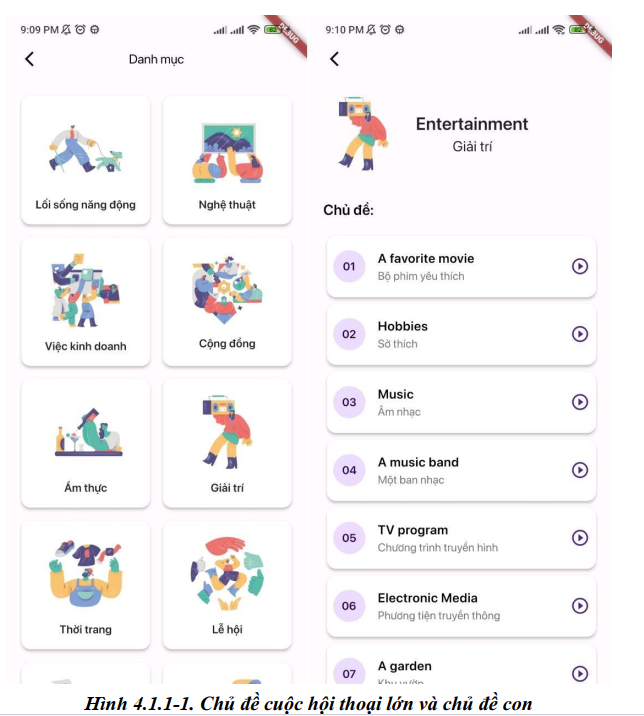
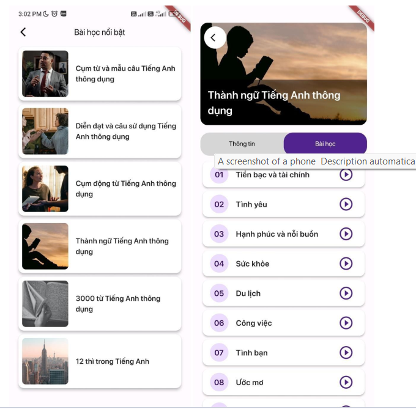
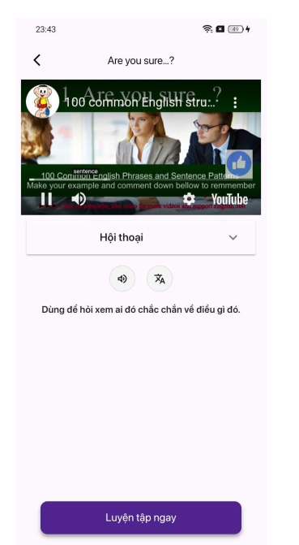
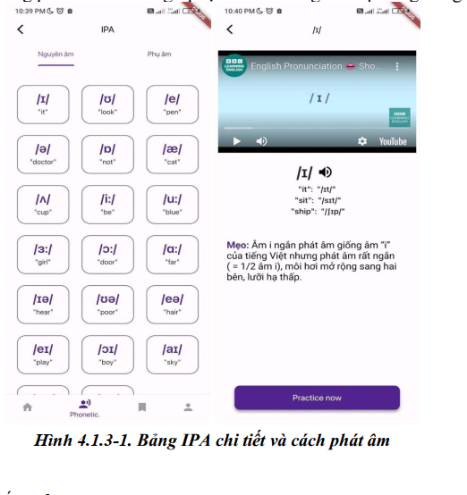
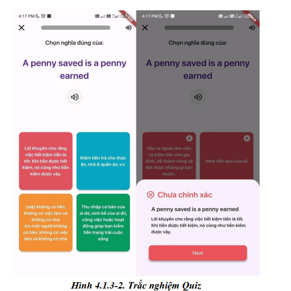

# 💫APP ENGLISH :
📚 English Learning App
Ứng dụng học tiếng Anh hỗ trợ người dùng rèn luyện từ vựng, ngữ pháp, và phát âm thông qua các bài học tương tác. Ứng dụng được phát triển bằng Flutter, sử dụng Riverpod để quản lý trạng thái, Firebase CLI để kết nối các dịch vụ đám mây, và SQLite để lưu trữ dữ liệu cục bộ.

🚀 Tính năng chính
✅ Danh sách từ vựng theo chủ đề

✅ Bài kiểm tra trắc nghiệm ngữ pháp

✅ Học từ bằng flashcard

✅ Đồng bộ hóa dữ liệu người dùng với Firebase

✅ Lưu lịch sử học tập cục bộ bằng SQLite

✅ Quản lý trạng thái với Riverpod (hooks_riverpod)

🛠 Công nghệ sử dụng
Công nghệ	Mô tả
Flutter	Framework UI đa nền tảng
Riverpod	Quản lý trạng thái ứng dụng
Firebase CLI	Triển khai và quản lý backend với Firebase Authentication, Firestore
SQLite	Lưu trữ dữ liệu ngoại tuyến (offline)
Dart	Ngôn ngữ lập trình chính của Flutter

⚙️ Cài đặt & chạy dự án
1. Cài đặt Flutter
   bash
   Sao chép
   Chỉnh sửa
   https://docs.flutter.dev/get-started/install
2. Clone dự án
   bash
   Sao chép
   Chỉnh sửa
   git clone https://github.com/yourusername/english-learning-app.git
   cd english-learning-app
3. Cài đặt Firebase CLI
   bash
   Sao chép
   Chỉnh sửa
   npm install -g firebase-tools
   firebase login
   firebase init
4. Cài đặt dependencies Flutter
   bash
   Sao chép
   Chỉnh sửa
   flutter pub get
5. Cài đặt SQLite plugin (nếu cần)
   bash
   Sao chép
   Chỉnh sửa
   flutter pub add sqflite
   flutter pub add path
6. Chạy ứng dụng
   bash
   Sao chép
   Chỉnh sửa
   flutter run
   🔐 Tích hợp Firebase
   Sử dụng Firebase CLI để cấu hình Firebase Authentication và Firestore

Thêm file google-services.json (Android) hoặc GoogleService-Info.plist (iOS) vào thư mục tương ứng

Các tính năng Firebase bao gồm:

Đăng nhập bằng email/mật khẩu

Lưu tiến trình học tập lên Firestore

🧠 Ghi chú phát triển
Riverpod được sử dụng theo kiến trúc "clean architecture"

SQLite dùng để lưu thông tin từ vựng đã học, điểm bài kiểm tra,...

App hoạt động được cả khi offline, đồng bộ khi có mạng

📌 TODO (phát triển tiếp theo)
AI TIẾNG ANH

## 🌐Socials

# 💻Tech Stack
   
# 📊GitHub Stats :
 
 

### ✍️Random Dev Quote

### 😂UI DEV

---

